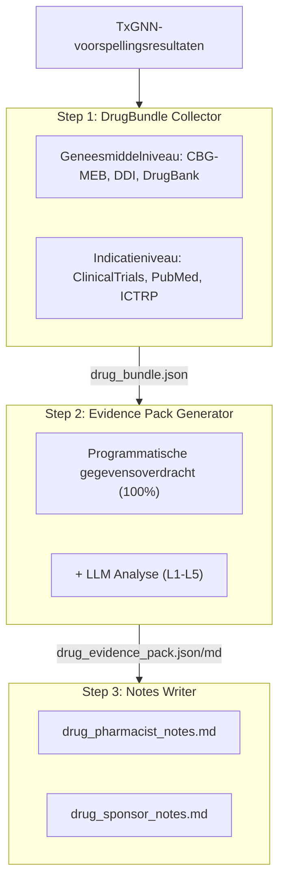
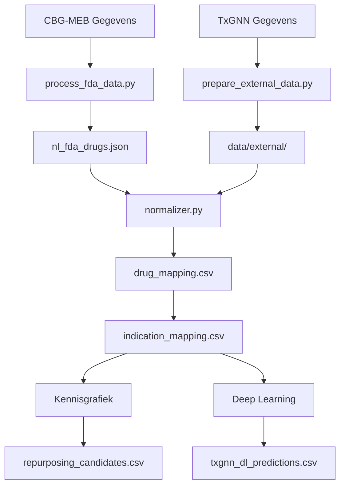

# NlTxGNN - Nederland: Herpositionering van Geneesmiddelen

[](https://nltxgnn.yao.care)
[](https://opensource.org/licenses/MIT)

Voorspellingen voor herpositionering van geneesmiddelen voor door CBG-MEB (Netherlands) goedgekeurde geneesmiddelen met het TxGNN-model.

## Disclaimer

- De resultaten van dit project zijn uitsluitend voor onderzoeksdoeleinden en vormen geen medisch advies.
- Kandidaten voor herpositionering van geneesmiddelen vereisen klinische validatie voor toepassing.

## Projectoverzicht

### Rapportstatistieken

| Item | Aantal |
|------|------|
| **Geneesmiddelrapporten** | 145 |
| **Totale voorspellingen** | 2,473,755 |
| **Unieke geneesmiddelen** | 145 |
| **Unieke indicaties** | 17,081 |
| **DDI-gegevens** | 302,516 |
| **DFI-gegevens** | 857 |
| **DHI-gegevens** | 35 |
| **DDSI-gegevens** | 8,359 |
| **FHIR-bronnen** | 145 MK / 50,000 CUD |

### Verdeling bewijsniveaus

| Bewijsniveau | Aantal rapporten | Beschrijving |
|---------|-------|------|
| **L1** | 0 | Meerdere Fase 3 RCT's |
| **L2** | 0 | Enkele RCT of meerdere Fase 2 |
| **L3** | 0 | Observationele studies |
| **L4** | 0 | Preklinische / mechanistische studies |
| **L5** | 145 | Alleen computationele voorspelling |

### Per bron

| Bron | Voorspellingen |
|------|------|
| KG | 2,231,733 |
| KG + DL | 241,248 |
| DL | 774 |

### Per vertrouwen

| Vertrouwen | Voorspellingen |
|------|------|
| very_high | 10,405 |
| high | 231,326 |
| medium | 2,231,861 |
| low | 163 |

---

## Voorspellingsmethoden

| Methode | Snelheid | Nauwkeurigheid | Vereisten |
|------|------|--------|----------|
| Kennisgrafiek | Snel (seconden) | Lager | Geen speciale vereisten |
| Deep Learning | Langzaam (uren) | Hoger | Conda + PyTorch + DGL |

### Kennisgrafiek-methode

```bash
uv run python scripts/run_kg_prediction.py
```

| Metriek | Waarde |
|------|------|
| CBG-MEB Totaal geneesmiddelen | 1,191 |
| Herpositioneringskandidaten | 2,472,981 |

### Deep Learning-methode

```bash
conda activate txgnn
PYTHONPATH=src python -m nltxgnn.predict.txgnn_model
```

| Metriek | Waarde |
|------|------|
| Totale DL-voorspellingen | 242,010 |
| Unieke geneesmiddelen | 145 |
| Unieke indicaties | 17,081 |

### Score-interpretatie

De TxGNN-score vertegenwoordigt het vertrouwen van het model in een geneesmiddel-ziektepaar, varierend van 0 tot 1.

| Drempelwaarde | Betekenis |
|-----|------|
| >= 0.9 | Zeer hoog vertrouwen |
| >= 0.7 | Hoog vertrouwen |
| >= 0.5 | Matig vertrouwen |

#### Scoreverdeling

| Drempelwaarde | Betekenis |
|-----|------|
| ≥ 0.9999 | Extreem hoog vertrouwen, meest betrouwbare voorspellingen van het model |
| ≥ 0.99 | Zeer hoog vertrouwen, prioriteit geven aan validatie |
| ≥ 0.9 | Hoog vertrouwen |
| ≥ 0.5 | Matig vertrouwen (sigmoide beslissingsgrens) |

#### Definities van bewijsniveaus

| Niveau | Definitie | Klinische betekenis |
|-----|------|---------|
| L1 | Fase 3 RCT of systematische review | Kan klinisch gebruik ondersteunen |
| L2 | Fase 2 RCT | Kan overwogen worden voor gebruik |
| L3 | Fase 1 of observationele studie | Vereist verdere evaluatie |
| L4 | Casusrapport of preklinisch onderzoek | Nog niet aanbevolen |
| L5 | Alleen computationele voorspelling, geen klinisch bewijs | Vereist verder onderzoek |

#### Belangrijke herinneringen

1. **Hoge scores garanderen geen klinische werkzaamheid: TxGNN-scores zijn op kennisgrafiek gebaseerde voorspellingen die klinische validatie vereisen.**
2. **Lage scores betekenen niet ineffectief: het model heeft mogelijk bepaalde associaties niet geleerd.**
3. **Aanbevolen om te gebruiken met validatiepijplijn: gebruik de hulpmiddelen van dit project om klinische studies, literatuur en ander bewijs te beoordelen.**

### Validatiepijplijn



---

## Snelstart

### Stap 1: Gegevens downloaden

| Bestand | Download |
|------|------|
| CBG-MEB Gegevens | Gegevensbron |
| node.csv | [Harvard Dataverse](https://dataverse.harvard.edu/api/access/datafile/7144482) |
| kg.csv | [Harvard Dataverse](https://dataverse.harvard.edu/api/access/datafile/7144484) |
| edges.csv | [Harvard Dataverse](https://dataverse.harvard.edu/api/access/datafile/7144483) |
| model_ckpt.zip | [Google Drive](https://drive.google.com/uc?id=1fxTFkjo2jvmz9k6vesDbCeucQjGRojLj) |

### Stap 2: Afhankelijkheden installeren

```bash
uv sync
```

### Stap 3: Geneesmiddelgegevens verwerken

```bash
uv run python scripts/process_fda_data.py
```

### Stap 4: Vocabulairegegevens voorbereiden

```bash
uv run python scripts/prepare_external_data.py
```

### Stap 5: Kennisgrafiek-voorspelling uitvoeren

```bash
uv run python scripts/run_kg_prediction.py
```

### Stap 6: Deep Learning-omgeving instellen

```bash
conda create -n txgnn python=3.11 -y
conda activate txgnn
pip install torch==2.2.2 torchvision==0.17.2
pip install dgl==1.1.3
pip install git+https://github.com/mims-harvard/TxGNN.git
pip install pandas tqdm pyyaml pydantic ogb
```

### Stap 7: Deep Learning-voorspelling uitvoeren

```bash
conda activate txgnn
PYTHONPATH=src python -m nltxgnn.predict.txgnn_model
```

---

## Bronnen

### TxGNN Kern

- [TxGNN Paper](https://www.nature.com/articles/s41591-024-03233-x) - Nature Medicine, 2024
- [TxGNN GitHub](https://github.com/mims-harvard/TxGNN)
- [TxGNN Explorer](http://txgnn.org)

### Gegevensbronnen

| Categorie | Gegevens | Bron | Opmerking |
|------|------|------|------|
| **Geneesmiddelgegevens** | CBG-MEB | - | Netherlands |
| **Kennisgrafiek** | TxGNN KG | [Harvard Dataverse](https://dataverse.harvard.edu/dataset.xhtml?persistentId=doi:10.7910/DVN/IXA7BM) | 17,080 diseases, 7,957 drugs |
| **Geneesmiddeldatabase** | DrugBank | [DrugBank](https://go.drugbank.com/) | Ingredientkoppeling geneesmiddelen |
| **Geneesmiddelinteracties** | DDInter 2.0 | [DDInter](https://ddinter2.scbdd.com/) | DDI-paren |
| **Geneesmiddelinteracties** | Guide to PHARMACOLOGY | [IUPHAR/BPS](https://www.guidetopharmacology.org/) | Goedgekeurde geneesmiddelinteracties |
| **Klinische studies** | ClinicalTrials.gov | [CT.gov API v2](https://clinicaltrials.gov/data-api/api) | Register klinische studies |
| **Klinische studies** | WHO ICTRP | [ICTRP API](https://apps.who.int/trialsearch/api/v1/search) | Internationaal platform klinische studies |
| **Literatuur** | PubMed | [NCBI E-utilities](https://eutils.ncbi.nlm.nih.gov/entrez/eutils/) | Medische literatuurzoekopdracht |
| **Naamkoppeling** | RxNorm | [RxNav API](https://rxnav.nlm.nih.gov/REST) | Standaardisatie geneesmiddelnamen |
| **Naamkoppeling** | PubChem | [PUG-REST API](https://pubchem.ncbi.nlm.nih.gov/docs/pug-rest) | Chemische stof synoniemen |
| **Naamkoppeling** | ChEMBL | [ChEMBL API](https://www.ebi.ac.uk/chembl/api/data) | Bioactiviteitsdatabase |
| **Standaarden** | FHIR R4 | [HL7 FHIR](http://hl7.org/fhir/) | MedicationKnowledge, ClinicalUseDefinition |
| **Standaarden** | SMART on FHIR | [SMART Health IT](https://smarthealthit.org/) | EHR-integratie, OAuth 2.0 + PKCE |

### Modeldownloads

| Bestand | Download | Opmerking |
|------|------|------|
| Voorgetraind model | [Google Drive](https://drive.google.com/uc?id=1fxTFkjo2jvmz9k6vesDbCeucQjGRojLj) | model_ckpt.zip |
| node.csv | [Harvard Dataverse](https://dataverse.harvard.edu/api/access/datafile/7144482) | Knooppuntgegevens |
| kg.csv | [Harvard Dataverse](https://dataverse.harvard.edu/api/access/datafile/7144484) | Kennisgrafikgegevens |
| edges.csv | [Harvard Dataverse](https://dataverse.harvard.edu/api/access/datafile/7144483) | Randgegevens (DL) |

## Projectintroductie

### Mapstructuur

```
NlTxGNN/
├── README.md
├── CLAUDE.md
├── pyproject.toml
│
├── config/
│   └── fields.yaml
│
├── data/
│   ├── kg.csv
│   ├── node.csv
│   ├── edges.csv
│   ├── raw/
│   ├── external/
│   ├── processed/
│   │   ├── drug_mapping.csv
│   │   ├── repurposing_candidates.csv
│   │   ├── txgnn_dl_predictions.csv.gz
│   │   └── integration_stats.json
│   ├── bundles/
│   └── collected/
│
├── src/nltxgnn/
│   ├── data/
│   │   └── loader.py
│   ├── mapping/
│   │   ├── normalizer.py
│   │   ├── drugbank_mapper.py
│   │   └── disease_mapper.py
│   ├── predict/
│   │   ├── repurposing.py
│   │   └── txgnn_model.py
│   ├── collectors/
│   └── paths.py
│
├── scripts/
│   ├── process_fda_data.py
│   ├── prepare_external_data.py
│   ├── run_kg_prediction.py
│   └── integrate_predictions.py
│
├── docs/
│   ├── _drugs/
│   ├── fhir/
│   │   ├── MedicationKnowledge/
│   │   └── ClinicalUseDefinition/
│   └── smart/
│
├── model_ckpt/
└── tests/
```

**Legenda**: 🔵 Projectontwikkeling | 🟢 Lokale gegevens | 🟡 TxGNN-gegevens | 🟠 Validatiepijplijn

### Gegevensstroom



---

## Citering

Als u deze dataset of software gebruikt, citeer dan:

```bibtex
@software{nltxgnn2026,
  author       = {Yao.Care},
  title        = {NlTxGNN: Drug Repurposing Validation Reports for Netherlands CBG-MEB Drugs},
  year         = 2026,
  publisher    = {GitHub},
  url          = {https://github.com/yao-care/NlTxGNN}
}
```

Citeer ook het oorspronkelijke TxGNN-artikel:

```bibtex
@article{huang2023txgnn,
  title={A foundation model for clinician-centered drug repurposing},
  author={Huang, Kexin and Chandak, Payal and Wang, Qianwen and Haber, Shreyas and Zitnik, Marinka},
  journal={Nature Medicine},
  year={2023},
  doi={10.1038/s41591-023-02233-x}
}
```
